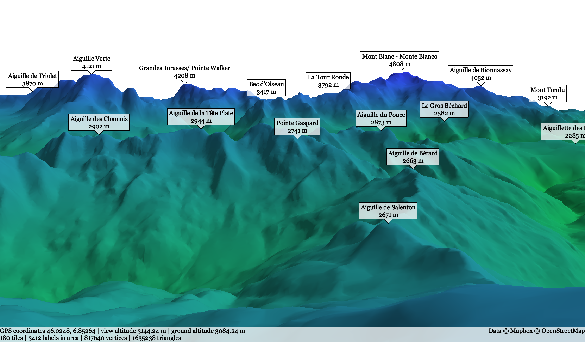

# Panoramix - fast and lightweight 3D view of your surroundings

This program shows an interactive 3D panorama of any place on Earth, with relevant points-of-interest (mountain peaks, etc.).
It is designed to be lightweight and fast, thanks to optimized geometric algorithms implemented in C++.

## License

Copyright (C) 2017  Guillaume Endignoux

This program is free software: you can redistribute it and/or modify
it under the terms of the GNU General Public License as published by
the Free Software Foundation, either version 3 of the License, or
(at your option) any later version.

This program is distributed in the hope that it will be useful,
but WITHOUT ANY WARRANTY; without even the implied warranty of
MERCHANTABILITY or FITNESS FOR A PARTICULAR PURPOSE.  See the
GNU General Public License for more details.

You should have received a copy of the GNU General Public License
along with this program.  If not, see http://www.gnu.org/licenses/gpl-3.0.txt

## Usage

### Configuration

Configuration parameters are set in the file `src/config.hpp`.
The most important parameters are the following.

* **API token**: terrain data is downloaded from [Mapbox](https://www.mapbox.com/) and a token is needed to use this API.
This proof-of-concept does not include any token so it is your responsibility to acquire a token.
Once you have a token, put it in the `MAPBOX_TOKEN` field of the configuration file.
* **"Retina" display**: for some reason, screens with "retina" display have a larger pixel resolution than coordinate resolution (size of windows, position to draw text, etc.).
This effect (observed on MacOS) must be accounted for when reading a pixel depth buffer to detect visible labels, and drawing those labels.
Chose a `RETINA_FACTOR` of 1 on normal displays, and 2 on "retina" displays (or maybe more if you have a futuristic super-retina display).
There may be a way to detect this factor at runtime, so if you find a portable API to do it your contribution is welcomed!
* **Earth curvature**: a simple model assumes a locally flat Earth, with Mercator coordinates simply scaled according to the origin's latitude.
This approximation is already good but slightly inaccurate: an angle of 1 degree on the surface of the Earth represents ~110 kilometers.
Common mountains can be seen at such a distance, and by simple geometry they should appear 0.5 degree closer to the horizon compared to the flat Earth model.
You can enable a more precise model that accounts for the Earth curvature, assuming a spheric Earth (which is a good approximation of the Earth ellipsoid).
* You can also tune the Earth radius (the default is the equator's radius) and other parameters if you feel like it (but results are not guaranteed for absurd values).

### Labels

Apart from the terrain data downloaded on the fly with Mapbox API, this project needs a local file containing labels (mountain peaks, mountain passes, etc.).
The program expects a file named `labels` in the current directory, that follows the grammar defined in `src/protobuf/labels.proto`.
Each label contains GPS coordinates, a name and optionally its elevation in *meters* (e.g. for mountain peaks), as well as a type (mountain peak, moutain pass, etc.).

A sample `labels` file containing labels for Switzerland is provided in the `data/` folder (you need to decompress it with e.g. `unxz`).
The program expects it in the `data/labels` path (relative to the current directory), so you may need to create a `data/` folder in your build directory and move the `labels` file inside it.

Creating a more comprehensive `labels` file that fits your need is left as an exercise.

### Dependencies

You first need to install [protocol buffers](https://developers.google.com/protocol-buffers/) on your machine.
Then, run `setup.sh` to generate C++ code from `.proto` files.

You need to have the (header-only) [asio library](https://think-async.com/) on your machine and update the `INCLUDEPATH` variable in `src/panoramix.pro` accordingly.

You also need development files for `zlib` (to parse gzip-compressed HTTP streams).

The program needs to be linked with OpenSSL (or similar), `libprotobuf` and `zlib` shared libraries.
Instructions may vary depending on your OS, but in any case you have to modify the `LIBS` variable in `src/panoramix.pro`.

### Installation

Once you have installed the dependencies and updated the configuration file, you can simply compile and run the program with QtCreator.

### Controls

A default view is loaded with GPS coordinates set in `src/main.cpp`.
You can use the *Open* menu item and enter GPS coordinates to create a new view.

To move in the 3D scene, use the following controls:

* **zoom**: mouse wheel, or keys I and O,
* **turn camera**: mouse drag and drop, or arrow left/right,
* **move forward/backward (w.r.t. the ground)**: arrow up/down (small increments) or page up/down (large increments),
* **move up/down**: keys U and D (small increments) or T and B (large increments),
* **go back to the ground**: key G,
* **move the sunlight**: keys E (clockwise, i.e. towards the evening for the Northern hemisphere) and M (anti-clockwise, i.e. towards the morning).

### Limitations

Depending on the location, the panorama is limited to points located up to a few hundred kilometers away.
Therefore, the panorama may be incomplete, as some high mountain peaks are visible from much further away.

Unfortunately for Arctic and Antarctic explorers, the view is limited to points located up to ~85 degrees of latitude (more precisely `atan(sinh(pi))`), due to the [Mercator projection](https://en.wikipedia.org/wiki/Web_Mercator) used by the underlying API to obtain terrain data.

## Design

### GUI

The user interface is implemented with Qt5 for the (very basic) windows.

The 3D scene is implemented with Qt5's frontend to OpenGL, which make it easier to manage shaders and vertex buffers, compared to the raw OpenGL API.
There is a buffer for vertices, a buffer for normals and an index buffer for triangles.

Labels are drawn with Qt's 2D drawing API (more precisely with `QPainter`), after reading OpenGL's depth buffer to detect visible points of interest.

### Geometry

At the geometric level, this program fetches terrain data from Mapbox vector tiles.
More precisely, it obtains elevation data from contour lines, and converts them into a set of points with known altitude (discarding the lines).
Then, a 2D Delaunay triangulation is created from these points to generate a 3D mesh of triangles.
Points are then projected to the model view (either locally flat Earth, or spheric Earth), and the mesh is given to OpenGL for rendering.

To compute Delaunay triangulations, the divide-and-conquer algorithm is due to Guibas and Stolfi, with the triangle-based data structure promoted by Shewchuk.

To compute the altitude of any point on the map (in particular the current point of view), the program finds the point in the Delaunay triangulation and interpolates elevation in the triangle that contains it.
A quadtree is used to speed up point lookup in the triangulation.

### Networking

The program uses networking to request terrain data from Mapbox; this is implemented with the [`asio` library](https://think-async.com/).
All operations are asynchronous (`async_connect`, `async_write`, etc.), and are performed in a separate networking thread.
A very basic local cache (limited to `CACHE_LIMIT` tiles) avoids redownloading the same tiles for views that overlap.

Additionally, another thread manages a queue of network requests to make sure that no more than `MAX_REQUESTS` requests are sent concurrently to the terrain data server (where `MAX_REQUESTS` is defined in the `src/config.hpp` file).

### Concurrency

Besides the UI and networking threads, a thread pool managed by asio's `io_service` decodes terrain data and computes geometric structures to build the world model (Delaunay triangulation, quadtree, mesh, etc.) in the background.
More precisely, a task is spawned for each tile to fetch the terrain data from the network or from the local cache and to decode it into a set of points.
Tiles are then fed to a simple multi-producer-single-consumer queue (based on a mutex and condition variable).
A separate task flushes the queue whenever new tiles are available, and builds a new world model with the new set of tiles.

Data structures in the world model (written by the background thread pool and read by the UI thread) are guarded by mutexes, and use `std::shared_ptr` to avoid contention on big data structures.
For example, the UI thread can make a copy of the shared pointer, release the mutex and start reading the world model.
In the meantime, the background thread can update the shared pointer with a new world model, that will be read by the UI thread later (e.g. at the next frame).
Note that the internal reference counting of `std::shared_ptr` is thread safe.

In practice, each shared data structure is not accessed more than a few hundreds of times per second, so simple mutexes and condition variables do the job, there is no need for lock-free data structures at this stage!

## Security

This project is written in C++14, with automatic memory management via smart pointers (`std::unique_ptr`, `std::shared_ptr`) or containers (often `std::vector`).
This itself does not remove all memory-related bugs; ASAN and UBSAN have been run on the project (and indeed uncovered some bugs, that are now fixed).

All data is downloaded via HTTPS.
TLS implementation relies on `asio::ssl::*` (which is usually based on OpenSSL or similar library on your system).
In particular, certificate validation uses `asio::ssl::rfc2818_verification`.
This project does not roll its own crypto!

HTTP/1 parsing is implemented in a very simple way, discarding all headers except for `Content-Encoding: gzip`, and reading data until the connection is closed.
GZIP parsing is a 50-line wrapper around `zlib`.
Other data formats are serialized with [protocol buffers](https://developers.google.com/protocol-buffers/), and the associated parsers were generated with `protoc`.

Due to the amount of concurrency, data races are the most probable potential security issues.
TSAN has also been run on the project (and uncovered some design issues), but it cannot detect all data races.

This project is a proof-of-concept and is not security-critical, so public disclosure of bugs is encouraged via GitHub issues.

